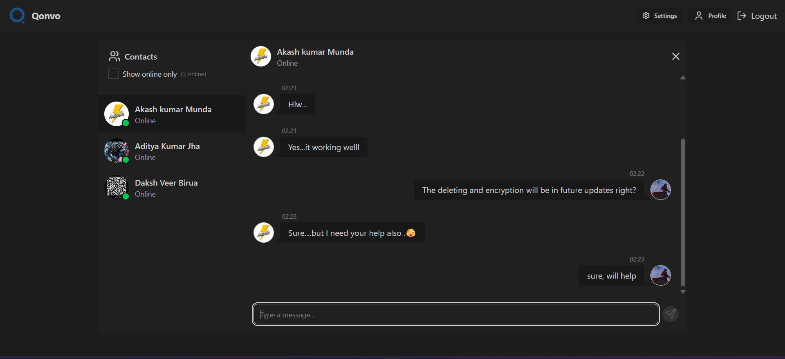

# **Qonvo** — A Blogging Web App

Welcome to **Qonvo**, a dynamic, full-featured blogging platform built using modern web technologies like **React**, **Node.js**, **Express**, **Redux**, and **MongoDB**. Designed for self-expression and storytelling, enables users to publish, manage, and explore rich content through a sleek, minimal interface.

 
 

##  Features

-  **User Authentication**  
  Secure Sign In / Sign Up flow using **JWT tokens** with protected routes and session-aware access.

-  **Responsive Dashboard**  
  A personalized dashboard to check created at, active status, profile picture.

-  **Profile Management**  
  Update your user details and photo using **Cloudinary** integration.

-  **Real-Time Preview**  
  Replies are styled with clean and classic text formatting.

-  **Theme Switch**  
  Built-in theme toggler for accessibility and user preference.

-  **Glassmorphism UI**  
  Aesthetic blur effects for modern and clean UI across the site.

-  **Vite-Powered Frontend**  
  Ultra-fast React development using **Vite**, **HTML**, styled with **Tailwind CSS**.

-  **Render-deploy Node server**  
  Secure strong server hosted on render with **Express**, **Mongoose**, **Socket** and other configs.

-  **Picture upload enabled**  
  Ability to upload pics for user profile.

 
  

##  Tech Stack

| Layer       | Technology                    |
|-------------|-------------------------------|
| Frontend    |         |
| Backend     |                  |
| Database    |   |
| Auth        |       |
| Media       |      |
| State Mgmt  |    |
| UI/UX       | Glassmorphism + Responsive design |
| Deployment  |   |

 
 

##  Live Demo

>_Deployment in finally done.....
Project is live on  **Render** for the API.

 
 

##  Pages & Flow

- **Home** → View published blogs
- **Login / Signup** → Secure access with JWT
- **Dashboard** → Create, edit, delete, and publish your blogs
- **Profile** → View and update your user details

 
 

## Security Highlights

- JWT authentication for protected API access
- CORS, Helmet, and secure headers implemented on server
- MongoDB and related ObjectId validation for safe operations

 
 

##  Purpose

> “I built Qonvo as a personal project to sharpen my full-stack development skills, explore modern UI design patterns, and create a production-ready chatting system from scratch.”

 
 

##  Screenshots

 
 

##  Future Plans

- Add like comments/replies to replies
- Reply editot with live preview
- SEO enhancements
- Monthly or time period based analytics dashboard

 
 

##  License

This is a personal project made for learning and growth.  
You’re welcome to take inspiration, but please don’t directly copy or reupload as your own project.

 
 

Made with ❤️ by  
